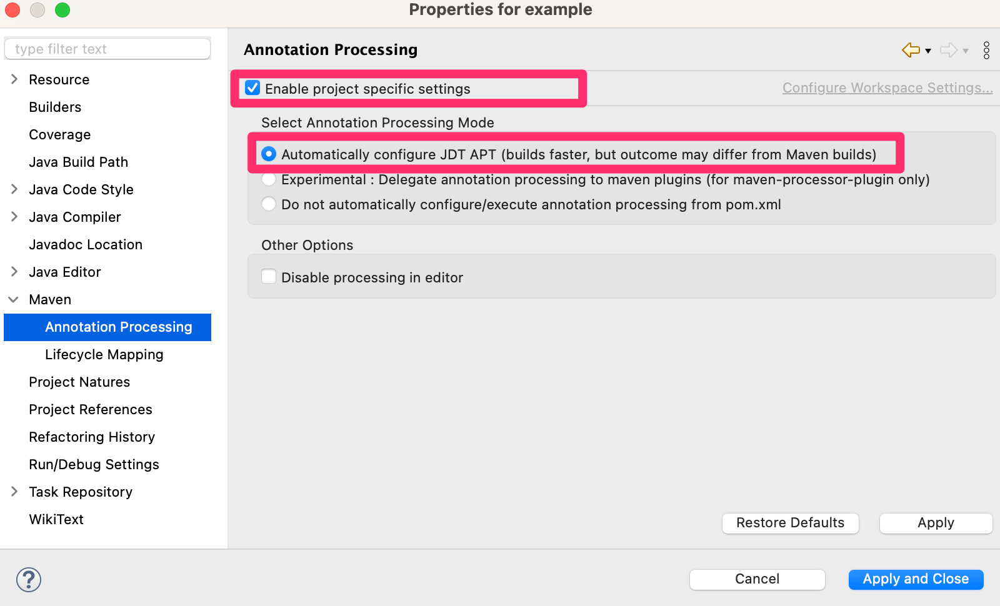

=======================
# Building an application

.. contents::
   :depth: 4

# Maven Central Repository

You can obtain the Doma framework artifacts from the Maven central repository.
We provide two artifacts: `doma-core` and `doma-processor`.

The `doma-core` artifact is required at both runtime and compile-time.
The `doma-processor` artifact, which provides annotation processors, is required only at compile-time.

The group id and artifact id of those artifacts are as follows:

:GroupId: org.seasar.doma
:ArtifactId: doma-core

:GroupId: org.seasar.doma
:ArtifactId: doma-processor

.. _build-with-gradle:

# Build with Gradle

Write your build.gradle(.kts) as follows:

.. tabs::

    .. tab:: Kotlin
    
```kotlin

            plugins {
                id("org.domaframework.doma.compile") version "{{ doma_compile_version }}"
            }
            
            dependencies {
                implementation("org.seasar.doma:doma-core:{{ doma_version }}")
                annotationProcessor("org.seasar.doma:doma-processor:{{ doma_version }}")
            }

    .. tab:: Groovy

```groovy

            plugins {
                id 'org.domaframework.doma.compile' version '3.0.1'
            }
            
            dependencies {
                implementation 'org.seasar.doma:doma-core:{{ doma_version }}'
                annotationProcessor 'org.seasar.doma:doma-processor:{{ doma_version }}'
            }

We recommend using the `org.domaframework.doma.compile`_ plugin to simplify your build script.

See build.gradle.kts in the `getting-started`_ repository as an example.

.. _build-with-maven:

# Build with Maven

Write your pom.xml as follows:

```xml

    ...
    <properties>
        <doma.version>{{ doma_version }}</doma.version>
    </properties>
    ...
    <dependencies>
        <dependency>
            <groupId>org.seasar.doma</groupId>
            <artifactId>doma-core</artifactId>
            <version>${doma.version}</version>
        </dependency>
    </dependencies>
    ...
    <build>
        <plugins>
            <plugin>
                <groupId>org.apache.maven.plugins</groupId>
                <artifactId>maven-compiler-plugin</artifactId>
                <version>3.8.1</version>
                <configuration>
                    <source>17</source> <!-- depending on your project -->
                    <target>17</target> <!-- depending on your project -->
                    <annotationProcessorPaths>
                        <path>
                            <groupId>org.seasar.doma</groupId>
                            <artifactId>doma-processor</artifactId>
                            <version>${doma.version}</version>
                        </path>
                    </annotationProcessorPaths>
                    <compilerArgs>
                        <!-- if you are using a Maven project in Eclipse, this argument is required -->
                        <arg>-Adoma.resources.dir=${project.basedir}/src/main/resources</arg>
                    </compilerArgs>
                </configuration>
            </plugin>
        </plugins>
    </build>

.. _build-with-eclipse:

# Build with Eclipse

## Gradle

Import your project as a Gradle project.
To reflect Gradle settings in Eclipse, right-click on your project and select Gradle > Refresh Gradle Project.

See build.gradle.kts in the `getting-started`_ repository as an example.

## Maven

Import your project as a Maven project.

Right-click on the project and select Properties > Maven > Annotation Processing.
Enable both "Enable Project specific settings" and "Automatically configure JDT APT"
as shown below.


    :alt: Eclipse Maven Annotation Processing

To refresh Maven settings in Eclipse, right-click on your project and select Maven > Update Project...

```{note}

    You must add the following argument to the Maven compiler plugin configuration in your pom.xml:

```xml

        <compilerArgs>
            <arg>-Adoma.resources.dir=${project.basedir}/src/main/resources</arg>
        </compilerArgs>

.. _build-with-idea:

# Build with IntelliJ IDEA

## Gradle

Import your project as a Gradle project.
Build and run using Gradle.

## Maven

Import your project as a Maven project.
Build and run using Maven.


.. _org.domaframework.doma.compile: https://github.com/domaframework/doma-compile-plugin
.. _com.diffplug.eclipse.apt: https://plugins.gradle.org/plugin/com.diffplug.eclipse.apt
.. _getting-started: https://github.com/domaframework/getting-started
