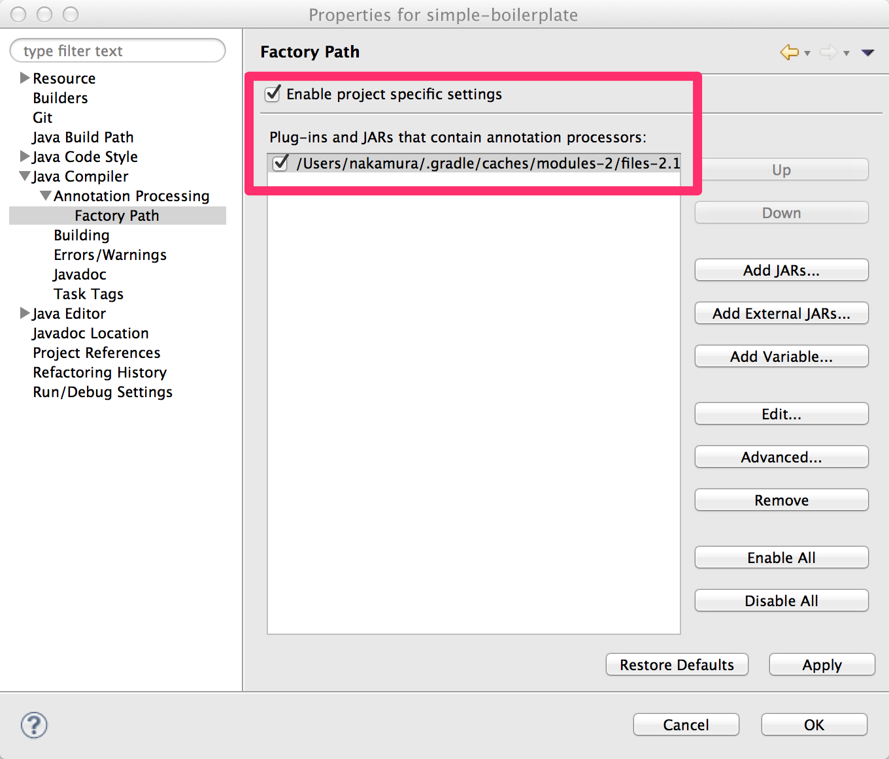

=======================
Building an application
=======================

.. contents::
   :depth: 3

Before You Start
================

Maven Central Repository
------------------------

You can pull the jar file of the Doma framework from the Maven central repository.
The group id and artifact id are as follows:

:GroupId: org.seasar.doma
:ArtifactId: doma

See also: https://search.maven.org/artifact/org.seasar.doma/doma/

.. _eclipse-build:

Build with Eclipse
==================

.. note::

  Instead of manual settings we show you below,
  we recommend to generate eclipse setting files automatically with
  `the Gradle Eclipse Plugin <https://docs.gradle.org/current/userguide/eclipse_plugin.html>`_.
  See also build.gradle and eclipse.gradle in the
  `domaframework/simple-boilerplate <https://github.com/domaframework/simple-boilerplate>`_
  repository.

Enabling annotation processing
------------------------------

- Select "Project > Properties" from the menu bar and open the dialog
- Select "Java Compiler > Annotation Processing" from the left menu of the dialog
- Check as follows:

Setting factory path
--------------------

- Select "Project > Properties" from the menu bar and open the dialog
- Select "Java Compiler > Annotation Processing > Factory Path" from the left menu of the dialog
- Add the jar file of the Doma framework whose version is same as the one in the Java Build Path
- Check as follows:

Build with IntelliJ IDEA
========================

See :ref:`idea-annotation-processor`.

.. _build-with-gradle:

Build with Gradle
=================

build.gradle as an example:

.. code-block:: groovy

  plugins {
      id 'java'
  }

  ext.domaResources = ['doma.compile.config', 'META-INF/**/*.sql', 'META-INF/**/*.script']

  task copyDomaResources(type: Sync) {
      from sourceSets.main.resources.srcDirs
      into compileJava.destinationDir
      include domaResources
  }

  compileJava {
      // copy doma related resources before compileJava
      dependsOn copyDomaResources
      options.encoding = 'UTF-8'
  }

  processResources {
      // exclude doma related resources
      exclude domaResources
  }

  compileTestJava {
      options.encoding = 'UTF-8'
      // disable the annotation processors during the test run
      options.compilerArgs = ['-proc:none']
  }

  repositories {
      mavenCentral()
      maven {url 'https://oss.sonatype.org/content/repositories/snapshots/'}
  }

  dependencies {
      annotationProcessor "org.seasar.doma:doma:2.28.1-SNAPSHOT"
      implementation "org.seasar.doma:doma:2.28.1-SNAPSHOT"
      runtimeOnly 'com.h2database:h2:1.3.175'
      testImplementation 'junit:junit:4.11'
  }

.. note::

  The description ``maven {url 'https://oss.sonatype.org/content/repositories/snapshots/'}`` is required
  only when you need the SNAPSHOT version of the Doma framework.

.. note::

  With the above build.gradle, you will benefits from
  `Incremental annotation processing <https://gradle.org/whats-new/gradle-5/#incremental-annotation-processing>`_.

See also build.gradle in the
`domaframework/simple-boilerplate <https://github.com/domaframework/simple-boilerplate>`_ repository.
