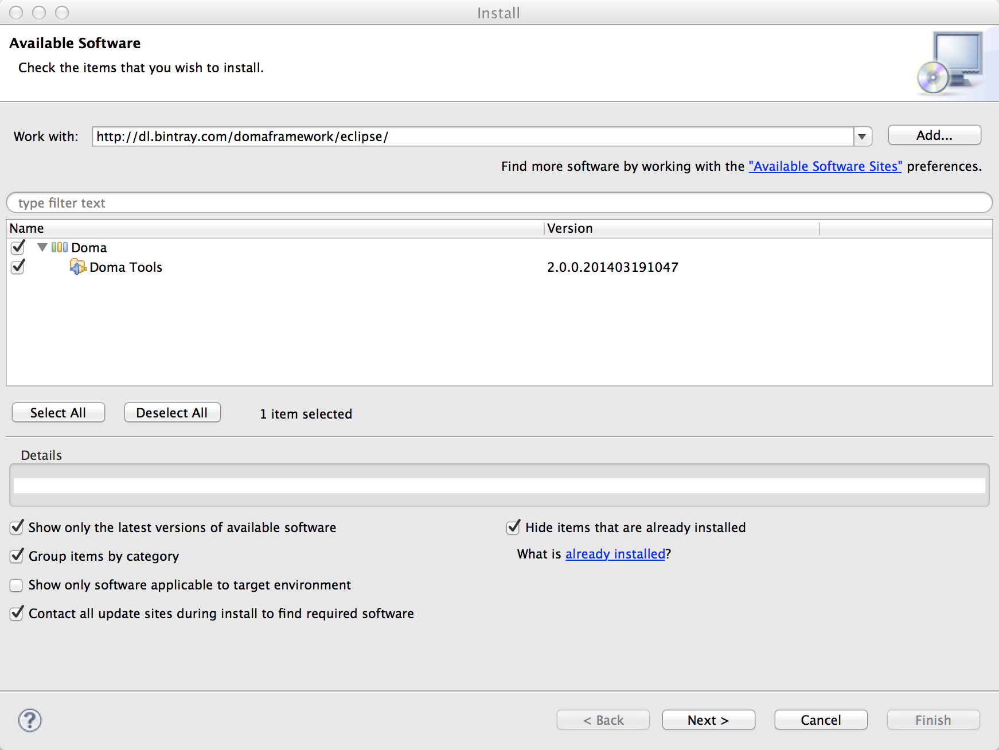
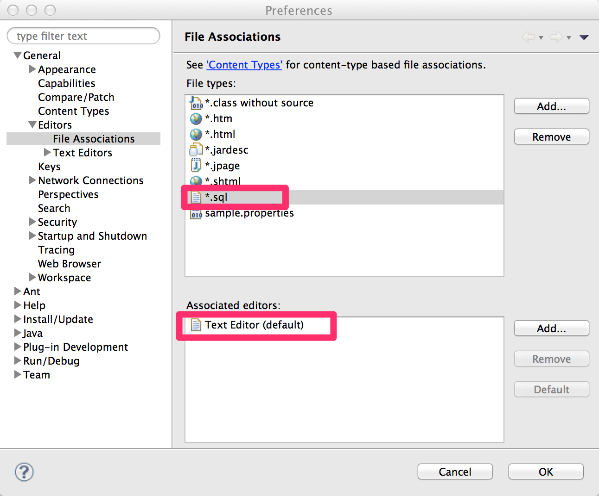
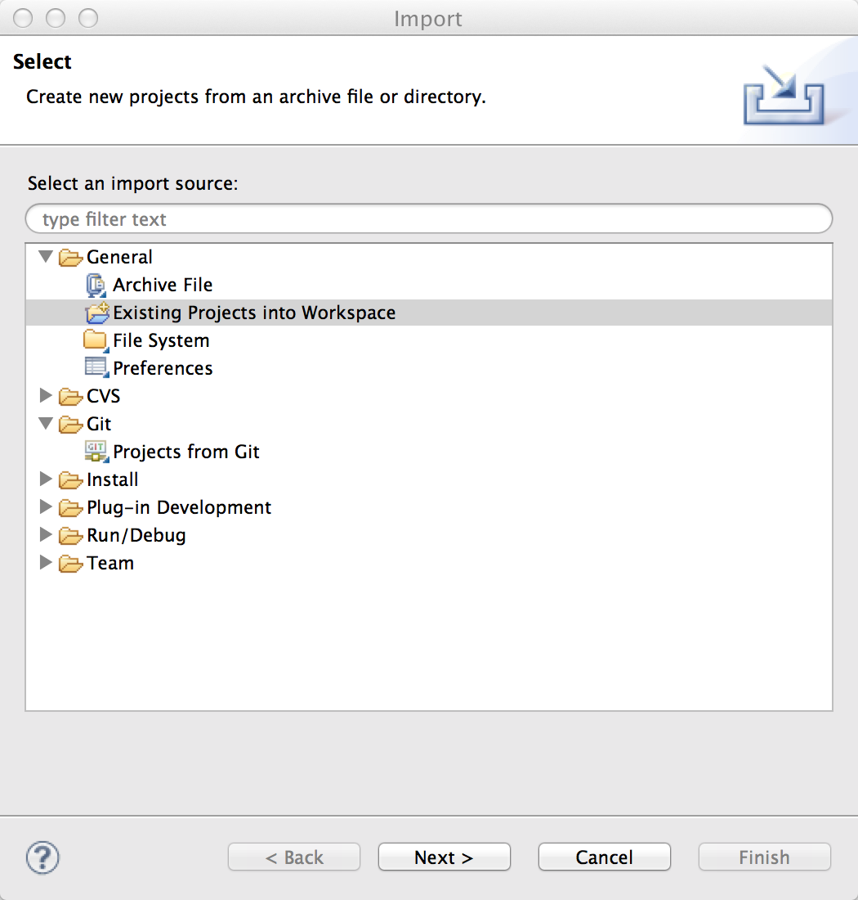
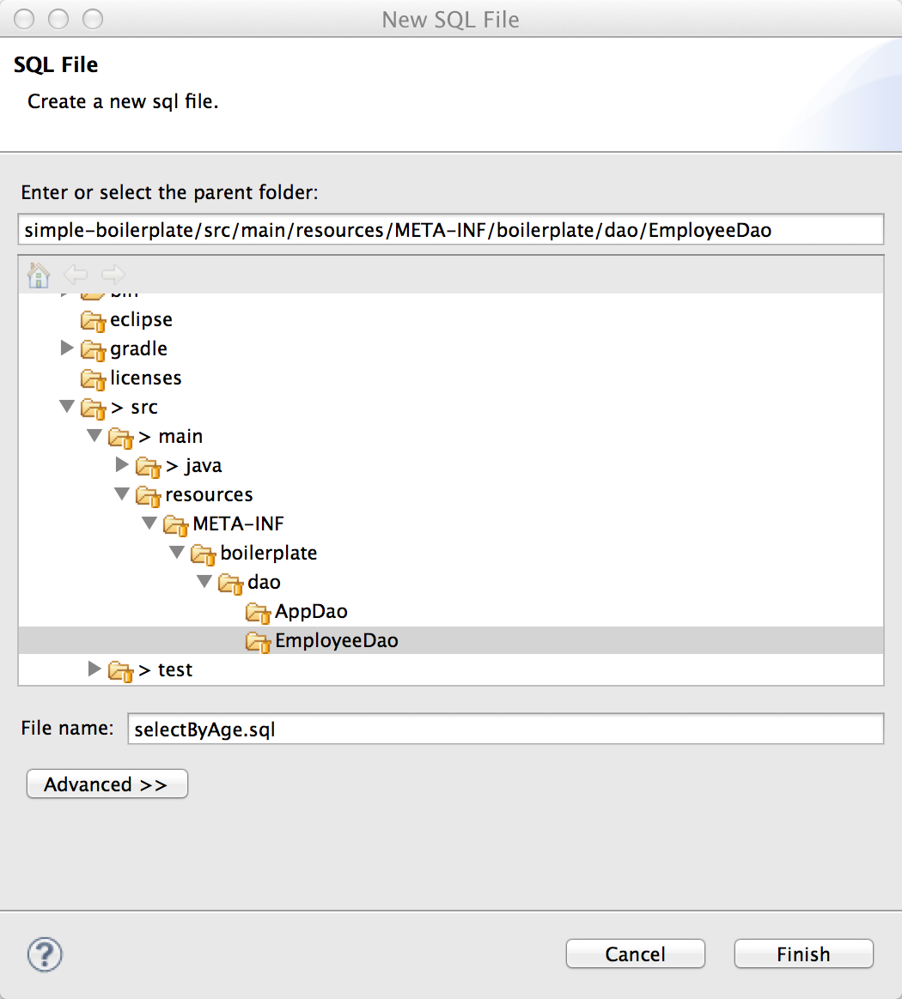

===============================
Get started!(Eclipse)
===============================

.. contents::
   :depth: 3

Summary
========

Introduce how to setting up development environment and how to executing basic database access.

Install JDK
============

.. _JDK 8: http://www.oracle.com/technetwork/java/javase/downloads/jdk8-downloads-2133151.html

You install `JDK 8`_ .

.. note::

  Doma supports JDK 8 and later.
  See also :ref:`Which version of JDK does Doma support?<which-version-of-jdk-does-doma-support>`.

Install Eclipse
===============

.. _Eclipse: http://www.eclipse.org/downloads/

You install `Eclipse`_ .

.. note::

  Running on Eclipse IDE for Java EE Developers and so on other
  but checking of running by Eclipse Standard 4.4 in this document.
  It seems to that it is running at higher version.

Install Doma Tools that is Eclipse plugin
============================================

Doma tool is plugin that enable mutual transition between Java file and SQL file.
This plugin is not required to using Doma, but if you use this plugin then productivity is growth.

You select Help > Install New Software... from menu bar and
input next url to 'Work With' textbox.

::

  http://dl.bintray.com/domaframework/eclipse/

Install enable plugin candidate is shown like below
then you check to Doma tool latest version
and go on dialog to finish installing.

Associate to file
------------------

Doma tools execute annotation processing by hook the file updating.
In order to do that , you need to open SQL file in Eclipse.

You select Eclipse > Preference... or Window > Preference from menu bar and open preference dialog.

You associate file that has ``.sql`` extensions to Text Editor like shown below figure.

Similarly you associate file that has ``.script`` extensions to Text Editor.

.. image:: images/script-file-association.png
   :width: 80 %

.. note::

   You can skip this setting
   if you use Eclipse IDE for Java EE Developers
   because SQL file is associated to specialized editor by default.

.. _Oracle SQL Developer: http://www.oracle.com/technetwork/developer-tools/sql-developer/overview/index.html
.. _pgAdmin: http://www.pgadmin.org/

.. note::

  We recommend to you development style that
  you create SQL by RDBMS specific tools (`Oracle SQL Developer`_ and `pgAdmin`_) and
  copy accomplished SQL to Eclipse editor.

Import template project
============================

You clone simple-boilerplate from GitHub.

.. code-block:: bash

  $ git clone https://github.com/domaframework/simple-boilerplate.git

Move to the cloned directory.

.. code-block:: bash

  $ cd simple-boilerplate

Create config file for Eclipse by next command.

.. code-block:: bash

  $ ./gradlew eclipse

.. note::

  You input ``gradlew eclipse`` instead of ``./gradlew eclipse`` in Windows environment.

.. note::

  Please set  JDK 8 (or JDK 9 and 10) installed directory to environment variable ``JAVA_HOME``.
  It is needed for executing gradlew.

.. note::

  The config that is for annotation processing config is included in Eclipse config file.
  Reference :ref:`eclipse-build` if configure by manual.

You select File > Import... from Eclipse menu bar and
select 'Existing Projects into Workspace' and import simple-boilerplate.

You select project and execute JUnit for confirming the accomplished the importing.
If one test case is success then importing was finished normally.

Structure of template project
=============================

The project source code's structure is like next.

::

  ─ src
    ├── main
    │   ├── java
    │   │   └── boilerplate
    │   │       ├── AppConfig.java
    │   │       ├── dao
    │   │       │   ├── AppDao.java
    │   │       │   └── EmployeeDao.java
    │   │       └── entity
    │   │           └── Employee.java
    │   └── resources
    │       └── META-INF
    │           └── boilerplate
    │               └── dao
    │                   ├── AppDao
    │                   │   ├── create.script
    │                   │   └── drop.script
    │                   └── EmployeeDao
    │                       ├── selectAll.sql
    │                       └── selectById.sql
    └── test
        ├── java
        │   └── boilerplate
        │       ├── DbResource.java
        │       └── dao
        │           └── EmployeeDaoTest.java
        └── resources

Explain about important file.

AppConfig.java
  The :doc:`config` that is needed for executing Doma.

AppDao.java
  Utility that create/drop the database schema that is using in this application.
  This is not need in production environment.
  The script file is under ``META-INF/boilerplate/dao/AppDao/`` and is used for creating and dropping schema.

Employee.java
  The :doc:`entity` that correspond to `EMPLOYEE` table within database.

EmployeeDao.java
  The :doc:`dao` that is execute getting and updating ``Employee`` class.
  The SQL file is under ``META-INF/boilerplate/dao/EmployeeDao/`` and is used.

EmployeeDaoTest.java
  The test that is using ``EmployeeDao``.
  You can learn about Doma by adding test case to this file.
  Other test is not affected by updating data because database schema is created and disposed per test method.

Mutual transition between Java file and SQL file
=================================================

``EmployeeDao.java`` is defined like next.

.. code-block:: java

  @Dao(config = AppConfig.class)
  public interface EmployeeDao {

      @Select
      List<Employee> selectAll();

      @Select
      Employee selectById(Integer id);

      @Insert
      int insert(Employee employee);

      @Update
      int update(Employee employee);

      @Delete
      int delete(Employee employee);

  }

You move cursor to ``selectById`` method and do right click at Eclipse editor and show context menu.
You can transition to ``META-INF/boilerplate/dao/EmployeeDao/selectById.sql`` file by selecting Doma > Jum to SQL in menu.

Next, you put cursor to arbitrary place in ``META-INF/boilerplate/dao/EmployeeDao/selectById.sql`` file and show context menu.
You can back to ``EmployeeDao.java`` file by selecting Doma > Jump to Java in menu.

SQL File
============

You open ``META-INF/boilerplate/dao/EmployeeDao/selectById.sql`` file.
This file is described like next.

.. code-block:: sql

  select
      /*%expand*/*
  from
      employee
  where
      id = /* id */0

The ``/*%expand*/`` show that expansioning column list by referencing entity class that is mapped at Java method.

The ``/* id */`` show that Java method parameter value is binding to this SQL.

The ``0`` that is placed at behind is test data.
By including this test data, you can confirm easily that there is not mistake in SQL at executing by tool.
Test data is not used at executing Java program.

About detail you reference :doc:`sql`.

Search
=========

You call Dao method that is annotated ``@Select`` for executing :doc:`query/select` process.

Add searching process
----------------------

Show how to adding process that searching young employee than arbitrary age.

You add next program code to ``EmployeeDao``.

.. code-block:: java

   @Select
   List<Employee> selectByAge(Integer age);

At this time, next error message is shown on Eclipse by annotation process.

::

  [DOMA4019] The file[META-INF/boilerplate/dao/EmployeeDao/selectByAge.sql] is is not found from the classpath.

You move cursor to ``selectByAge`` method and show context menu by doing right click,
and you select Doma > Jump to SQL in menu.

The dialog that is for creating SQL file is show like next.

You push 'Finish' and create file.

After creating file, you save the file that state is empty and back to ``EmployeeDao`` then error message is changed.

::

  [DOMA4020] The SQL template is empty. PATH=[META-INF/boilerplate/dao/EmployeeDao/selectByAge.sql].

You back to ``selectByAge.sql`` file and describe next SQL.

.. code-block:: sql

  select
      /*%expand*/*
  from
      employee
  where
      age < /* age  */0

Then error is resolved.

Execute searching process
--------------------------

Actually execute the created searching process at the above.

You add next code to ``EmployeeDaoTest``.

.. code-block:: java

  @Test
  public void testSelectByAge() {
      TransactionManager tm = AppConfig.singleton().getTransactionManager();
      tm.required(() -> {
          List<Employee> employees = dao.selectByAge(35);
          assertEquals(2, employees.size());
      });
  }

You execute JUnit and confirm that this code is run.

At that time, created for the searching SQL is next.

.. code-block:: sql

  select
      age, id, name, version
  from
      employee
  where
      age < 35

Insert
=======

For executing :doc:`query/insert` process, you call Dao method that is annotated ``@Insert`` annotation.

Execute insert process
-----------------------

You confirm that next code is exists at ``EmployeeDao``.

.. code-block:: java

  @Insert
  int insert(Employee employee);

Execute insert process by using this code.

You add next code to ``EmployeeDaoTest``.

.. code-block:: java

  @Test
  public void testInsert() {
      TransactionManager tm = AppConfig.singleton().getTransactionManager();

      Employee employee = new Employee();

      // First transaction
      // Execute inserting
      tm.required(() -> {
          employee.name = "HOGE";
          employee.age = 20;
          dao.insert(employee);
          assertNotNull(employee.id);
      });

      // Second transaction
      // Confirm that inserting is success
      tm.required(() -> {
          Employee employee2 = dao.selectById(employee.id);
          assertEquals("HOGE", employee2.name);
          assertEquals(Integer.valueOf(20), employee2.age);
          assertEquals(Integer.valueOf(1), employee2.version);
      });
  }

You execute JUnit and confirm that this code is run.

At that time, created for the inserting SQL is next.

.. code-block:: sql

  insert into Employee (age, id, name, version) values (20, 100, 'HOGE', 1)

Identifier and version number is automatically setting.

Update
========

For executing :doc:`query/update` process, you call Dao method that is annotated ``@Update`` annotation.

Execute update process
-----------------------

You confirm that next code is exists at ``EmployeeDao``.

.. code-block:: java

  @Update
  int update(Employee employee);

Execute update process by using this code.

You add next code to ``EmployeeDaoTest``.

.. code-block:: java

  @Test
  public void testUpdate() {
      TransactionManager tm = AppConfig.singleton().getTransactionManager();

      // First transaction
      // Search and update age field
      tm.required(() -> {
          Employee employee = dao.selectById(1);
          assertEquals("ALLEN", employee.name);
          assertEquals(Integer.valueOf(30), employee.age);
          assertEquals(Integer.valueOf(0), employee.version);
          employee.age = 50;
          dao.update(employee);
          assertEquals(Integer.valueOf(1), employee.version);
      });

      // Second transaction
      // Confirm that updating is success
      tm.required(() -> {
          Employee employee = dao.selectById(1);
          assertEquals("ALLEN", employee.name);
          assertEquals(Integer.valueOf(50), employee.age);
          assertEquals(Integer.valueOf(1), employee.version);
      });
  }

You execute JUnit and confirm that this code is run.

At that time, created for the updating SQL is next.

.. code-block:: sql

  update Employee set age = 50, name = 'ALLEN', version = 0 + 1 where id = 1 and version = 0

The version number that is for optimistic concurrency control is automatically increment.

Delete
=======

For executing :doc:`query/delete` process, you call Dao method that is annotated ``@Delete`` annotation.

Execute delete process
-----------------------

You confirm that next code is exists at ``EmployeeDao``.

.. code-block:: java

  @Delete
  int delete(Employee employee);

Execute delete process by using this code.

You add next code to ``EmployeeDaoTest``.

.. code-block:: java

  @Test
  public void testDelete() {
      TransactionManager tm = AppConfig.singleton().getTransactionManager();

      // First transaction
      // Execute deleting
      tm.required(() -> {
          Employee employee = dao.selectById(1);
          dao.delete(employee);
      });

      // Second transaction
      // Confirm that deleting is success
      tm.required(() -> {
          Employee employee = dao.selectById(1);
          assertNull(employee);
      });
  }

You execute JUnit and confirm that this code is run.

At that time, created for the deleting SQL is next.

.. code-block:: sql

  delete from Employee where id = 1 and version = 0

Identifier and version number is specified in search condition.
