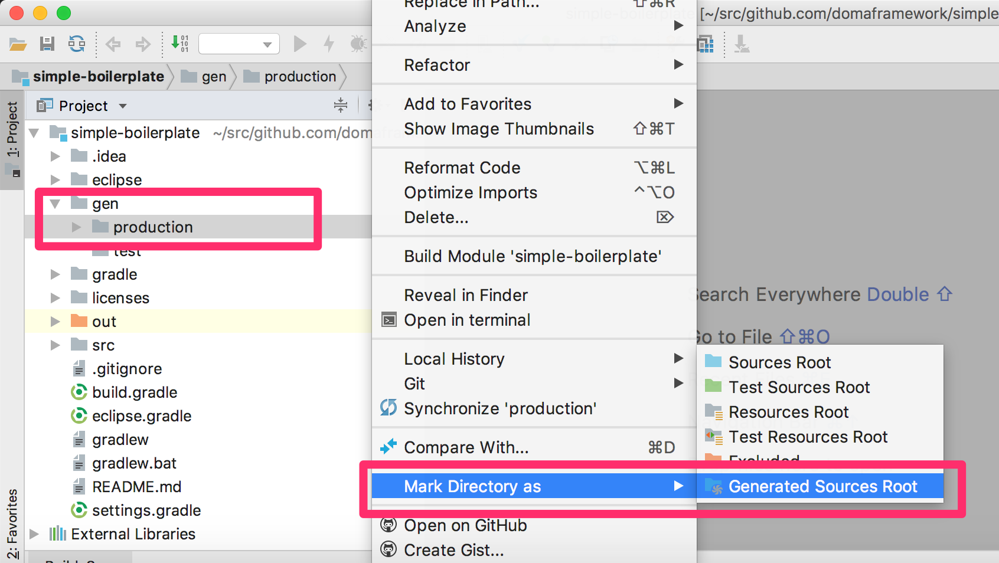

======================================
はじめよう！ (IntelliJ IDEA)
======================================

.. contents:: 目次
   :depth: 3

概要
====

開発環境のセットアップ方法と基本的なデータベースアクセスの実行方法を紹介します。

JDK のインストール
==================

.. _JDK 8: http://www.oracle.com/technetwork/java/javase/downloads/jdk8-downloads-2133151.html

`JDK 8`_ をインストールしてください。

.. note::

  JDK 9 や JDK 10 もサポートされています。

IntelliJ IDEA のインストール
==================================

.. _IntelliJ IDEA Community Edition: https://www.jetbrains.com/idea/download/

`IntelliJ IDEA Community Edition`_ をインストールしてください。

.. _IntelliJ Doma support plugin: https://plugins.jetbrains.com/plugin/7615-doma-support

.. note::

  このドキュメントでは、IDE として IntelliJ IDEA Community Edition を用います。
  IntelliJ IDEA Ultimate Edition を利用する場合は、 `IntelliJ Doma support plugin`_ の併用をお奨めします。

雛形プロジェクトのインポート
============================

GitHub から simple-boilerplate を clone してください。

.. code-block:: bash

  $ git clone https://github.com/domaframework/simple-boilerplate.git

IntelliJ IDEA を起動して Import Project を実行し、clone した simple-boilerplate を選択します。

.. image:: images/idea-welcome.png
   :width: 60 %

|

Import project from external model をチェックし、Gradle を選択します。 

.. image:: images/idea-import-project.png
   :width: 100 %

|

Use auto import をチェックし、 Create separate module per source set のチェックを外します。最後に Finish を押してください。

.. image:: images/idea-import-project-settings.png
   :width: 100 %

|

Build ツールウィンドウに synced successfully というメッセージが表示されればインポートは成功です。

.. _idea-annotation-processor:

Annotation Processor に関する設定
=====================================

Project ツールウィンドウのコンテキストメニューから Open Module Settings を選択します。

.. image:: images/idea-open-module-settings.png
   :width: 100 %

|

Modules の Paths の設定画面を開き、Inherit project compile output path が選択されていることを確認してください。
選択されていない場合は選択してください。

.. image:: images/idea-output-path.png
   :width: 100 %

|

Preferrences から Build, Execution, Deployment > Compiler > Annotation Processors を開きます。
Enable annotation processing をチェックしてください。
Module content root をチェックしてください。
Production sources directory には gen/production 、Test sources directory には gen/test と入力してください。
最後に OK を押してください。

.. image:: images/idea-annotation-processors.png
   :width: 100 %

|

メニューから Build Project を実行してください。
ビルドにより Annotation Processor により生成されたコードが gen/production に出力されます。
Project ツールウィンドウのコンテキストメニューから Mark Directory as | Generated Sources Root を選択し、
gen/production をソースパスに追加します。

雛形プロジェクトの構成
======================

プロジェクトのソースコードの構成は次のようになっています。

::

  ─ src
    ├── main
    │   ├── java
    │   │   └── boilerplate
    │   │       ├── AppConfig.java
    │   │       ├── dao
    │   │       │   ├── AppDao.java
    │   │       │   └── EmployeeDao.java
    │   │       └── entity
    │   │           └── Employee.java
    │   └── resources
    │       └── META-INF
    │           └── boilerplate
    │               └── dao
    │                   ├── AppDao
    │                   │   ├── create.script
    │                   │   └── drop.script
    │                   └── EmployeeDao
    │                       ├── selectAll.sql
    │                       └── selectById.sql
    └── test
        ├── java
        │   └── boilerplate
        │       ├── DbResource.java
        │       └── dao
        │           └── EmployeeDaoTest.java
        └── resources

主要なものについて説明します。

AppConfig.java
  Doma を実行するために必要な :doc:`config` です。

AppDao.java
  このアプリケーションで利用するデータベースのスキーマを実行時に作成/破棄するユーティリティです。
  実環境では不要になります。
  スキーマの作成と破棄には ``META-INF/boilerplate/dao/AppDao/`` 以下のスクリプトファイルを使用します。

Employee.java
  データベースの `EMPLOYEE` テーブルに対応する :doc:`entity` です。

EmployeeDao.java
  ``Employee`` クラスの取得や更新などを行う :doc:`dao` です。
  ``META-INF/boilerplate/dao/EmployeeDao/`` 以下の SQLファイル を使用します。

EmployeeDaoTest.java
  ``EmployeeDao`` を使ったテストです。
  このファイルにテストケースを追加しながら Doma の学習ができます。
  テストメソッドごとにデータベーススキーマの作成と破棄を行っているため
  データの更新によって他のテストが影響を受けることはありません。

SQL ファイル
============

``META-INF/boilerplate/dao/EmployeeDao/selectById.sql`` ファイルを開いてください。
このファイルには次のように記述されています。

.. code-block:: sql

  select
      /*%expand*/*
  from
      employee
  where
      id = /* id */0

``/*%expand*/`` は Java メソッドでマッッピングされた
エンティティクラスの定義を参照してカラムリストを展開することを示しています。

``/* id */`` は Java メソッドのパラメータの値がこの SQL へバインドされることを
示しています。

後ろにある ``0`` はテスト用のデータです。
このテストデータを含めることで、 SQL をツールで実行して構文上の
誤りがないことを容易に確認できます。
テスト用のデータは Java プログラム実行時には使われません。

詳細については、 :doc:`sql`  を参照してください。

検索
====

:doc:`query/select` 処理を実行するには、 ``@Select`` が注釈された Dao メソッドを呼び出します。

検索処理の追加
--------------

ある年齢より小さい従業員を検索する処理を追加する手順を示します。

``EmployeeDao`` に次のコードを追加し、ビルドを実行してください。

.. code-block:: java

   @Select
   List<Employee> selectByAge(Integer age);

このとき、注釈処理により次のエラーメッセージが Message ツールウィンドウ に表示されます。

::

  [DOMA4019] ファイル[META-INF/boilerplate/dao/EmployeeDao/selectByAge.sql]が
  クラスパスから見つかりませんでした。

``src/main/resources/META-INF/boilerplate/dao/EmployeeDao`` の直下に
`selectByAge.sql` という名前のファイルを作成し、ファイルは空のままにして再度ビルドしてください。

エラーメッセージの内容が変わります。

::

  [DOMA4020] SQLファイル[META-INF/boilerplate/dao/EmployeeDao/selectByAge.sql]が空です。

``selectByAge.sql`` ファイルに戻って次の SQL を記述してください。

.. code-block:: sql

  select
      /*%expand*/*
  from
      employee
  where
      age < /* age  */0

再度ビルドをするとエラーが解消されます。

検索処理の実行
--------------

上記で作成した検索処理を実際に実行します。

``EmployeeDaoTest`` に次のコードを追加してください。

.. code-block:: java

  @Test
  public void testSelectByAge() {
      TransactionManager tm = AppConfig.singleton().getTransactionManager();
      tm.required(() -> {
          List<Employee> employees = dao.selectByAge(35);
          assertEquals(2, employees.size());
      });
  }

JUnit を実行し、このコードが動作することを確認してください。

このとき発行される検索のための SQL は次のものです。

.. code-block:: sql

  select
      age, id, name, version
  from
      employee
  where
      age < 35

挿入
====

:doc:`query/insert` 処理を実行するには、 ``@Insert`` が注釈された Dao メソッドを呼び出します。

挿入処理の実行
--------------

``EmployeeDao`` に次のコードが存在することを確認してください。

.. code-block:: java

  @Insert
  int insert(Employee employee);

このコードを利用して挿入処理を実行します。

``EmployeeDaoTest`` に次のコードを追加してください。

.. code-block:: java

  @Test
  public void testInsert() {
      TransactionManager tm = AppConfig.singleton().getTransactionManager();

      Employee employee = new Employee();

      // 最初のトランザクション
      // 挿入を実行している
      tm.required(() -> {
          employee.name = "HOGE";
          employee.age = 20;
          dao.insert(employee);
          assertNotNull(employee.id);
      });

      // 2番目のトランザクション
      // 挿入が成功していることを確認している
      tm.required(() -> {
          Employee employee2 = dao.selectById(employee.id);
          assertEquals("HOGE", employee2.name);
          assertEquals(Integer.valueOf(20), employee2.age);
          assertEquals(Integer.valueOf(1), employee2.version);
      });
  }

JUnit を実行し、このコードが動作することを確認してください。

このとき発行される挿入のための SQL は次のものです。

.. code-block:: sql

  insert into Employee (age, id, name, version) values (20, 100, 'HOGE', 1)

識別子とバージョン番号が自動で設定されています。

更新
====

:doc:`query/update` 処理を実行するには、 ``@Update`` が注釈された Dao メソッドを呼び出します。

更新処理の実行
--------------

``EmployeeDao`` に次のコードが存在することを確認してください。

.. code-block:: java

  @Update
  int update(Employee employee);

このコードを利用して更新処理を実行します。

``EmployeeDaoTest`` に次のコードを追加してください。

.. code-block:: java

  @Test
  public void testUpdate() {
      TransactionManager tm = AppConfig.singleton().getTransactionManager();

      // 最初のトランザクション
      // 検索して age フィールドを更新している
      tm.required(() -> {
          Employee employee = dao.selectById(1);
          assertEquals("ALLEN", employee.name);
          assertEquals(Integer.valueOf(30), employee.age);
          assertEquals(Integer.valueOf(0), employee.version);
          employee.age = 50;
          dao.update(employee);
          assertEquals(Integer.valueOf(1), employee.version);
      });

      // 2番目のトランザクション
      // 更新が成功していることを確認している
      tm.required(() -> {
          Employee employee = dao.selectById(1);
          assertEquals("ALLEN", employee.name);
          assertEquals(Integer.valueOf(50), employee.age);
          assertEquals(Integer.valueOf(1), employee.version);
      });
  }

JUnit を実行し、このコードが動作することを確認してください。

このとき発行される更新のための SQL は次のものです。

.. code-block:: sql

  update Employee set age = 50, name = 'ALLEN', version = 0 + 1 where id = 1 and version = 0

楽観的排他制御のためのバージョン番号が自動でインクリメントされています。

削除
====

:doc:`query/delete` 処理を実行するには、 ``@Delete`` が注釈された Dao メソッドを呼び出します。

削除処理の実行
--------------

``EmployeeDao`` に次のコードが存在することを確認してください。

.. code-block:: java

  @Delete
  int delete(Employee employee);

このコードを利用して削除処理を実行します。

``EmployeeDaoTest`` に次のコードを追加してください。

.. code-block:: java

  @Test
  public void testDelete() {
      TransactionManager tm = AppConfig.singleton().getTransactionManager();

      // 最初のトランザクション
      // 削除を実行している
      tm.required(() -> {
          Employee employee = dao.selectById(1);
          dao.delete(employee);
      });

      // 2番目のトランザクション
      // 削除が成功していることを確認している
      tm.required(() -> {
          Employee employee = dao.selectById(1);
          assertNull(employee);
      });
  }

JUnit を実行し、このコードが動作することを確認してください。

このとき発行される削除のための SQL は次のものです。

.. code-block:: sql

  delete from Employee where id = 1 and version = 0

識別子に加えバージョン番号も検索条件に指定されます。

