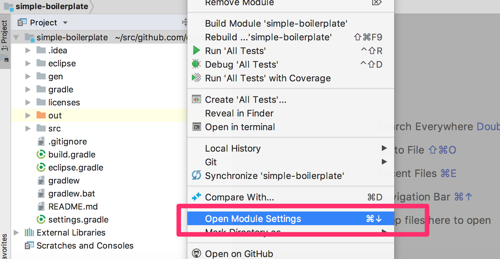

======================================
Get started!(IntelliJ IDEA)
======================================

.. contents::
   :depth: 3

Summary
========

Introduce how to setting up development environment and how to executing basic database access.

Install JDK
==================

.. _JDK 8: http://www.oracle.com/technetwork/java/javase/downloads/jdk8-downloads-2133151.html

You install `JDK 8`_ .

.. note::

  Doma support JDK 9 and JDK 10, 11.

Install IntelliJ IDEA
======================

.. _IntelliJ IDEA Community Edition: https://www.jetbrains.com/idea/download/

You install `IntelliJ IDEA Community Edition`_ .

.. _IntelliJ Doma support plugin: https://plugins.jetbrains.com/plugin/7615-doma-support

.. note::

  In this document, using IntelliJ IDEA Community Edition as IDE.
  If you use IntelliJ IDEA Ultimate Edition, recommend to you concomitant use with `IntelliJ Doma support plugin`_.

Import template project
============================

You clone simple-boilerplate from GitHub.

.. code-block:: bash

  $ git clone https://github.com/domaframework/simple-boilerplate.git

You start IntelliJ IDEA and execute Import Project, select the cloned simple-boilerplate.

.. image:: images/idea-welcome.png
   :width: 60 %

|

You check Import project from external model and select Gradle.

.. image:: images/idea-import-project.png
   :width: 100 %

|

You check Use auto-import and uncheck Create separate module per source set.
Finally you push Finish.

.. image:: images/idea-import-project-settings.png
   :width: 100 %

|

If the message that is synced successfully is shown at Build tool window then import is success.

.. _idea-annotation-processor:

Setting of Annotation Processor
================================

You select Open Module Settings from context menu on tool window.

|

You open setting screen of Paths of Modules and confirm that Inherit project compile output path is selected.
If it is not selected, you select it.

.. image:: images/idea-output-path.png
   :width: 100 %

|

You open Build, Execution, Deployment > Compiler > Annotation Processors from Preferences.
You check Enable annotation processing.
You check Module content root.
You input gen/production to Production sources directory and input gen/test to Test sources directory.
Finally push OK.

.. image:: images/idea-annotation-processors.png
   :width: 100 %

|

You execute Build Project from menu.
By build, the code that is generated by Annotation Processor is output to gen/production.
You select Mark Directory as | Generated Sources Root from context menu on Project tool window and add gen/production to source path.

.. image:: images/idea-generated-sources-root.png
   :width: 100 %

Structure of template project
==============================

The project source code's structure is like next.

::

  ─ src
    ├── main
    │   ├── java
    │   │   └── boilerplate
    │   │       ├── AppConfig.java
    │   │       ├── dao
    │   │       │   ├── AppDao.java
    │   │       │   └── EmployeeDao.java
    │   │       └── entity
    │   │           └── Employee.java
    │   └── resources
    │       └── META-INF
    │           └── boilerplate
    │               └── dao
    │                   ├── AppDao
    │                   │   ├── create.script
    │                   │   └── drop.script
    │                   └── EmployeeDao
    │                       ├── selectAll.sql
    │                       └── selectById.sql
    └── test
        ├── java
        │   └── boilerplate
        │       ├── DbResource.java
        │       └── dao
        │           └── EmployeeDaoTest.java
        └── resources

Explain about important file.

AppConfig.java
  The :doc:`config` that is needed for executing Doma.

AppDao.java
  Utility that create/drop the database schema that is using in this application.
  This is not need in production environment.
  The script file is under ``META-INF/boilerplate/dao/AppDao/`` and is used for creating and dropping schema.

Employee.java
  The :doc:`entity` that correspond to `EMPLOYEE` table within database.

EmployeeDao.java
  The :doc:`dao` that is execute getting and updating ``Employee`` class.
  The SQL file is under ``META-INF/boilerplate/dao/EmployeeDao/`` and is used.

EmployeeDaoTest.java
  The test that is using ``EmployeeDao``.
  You can learn about Doma by adding test case to this file.
  Other test is not affected by updating data because database schema is created and disposed per test method.

SQL file
=========

You open ``META-INF/boilerplate/dao/EmployeeDao/selectById.sql`` file.
This file is described like next.

.. code-block:: sql

  select
      /*%expand*/*
  from
      employee
  where
      id = /* id */0

The ``/*%expand*/`` show that expansioning column list by referencing entity class that is mapped at Java method.

The ``/* id */`` show that Java method parameter value is binding to this SQL.

The ``0`` that is placed at behind is test data.
By including this test data, you can confirm easily that there is not mistake in SQL at executing by tool.
Test data is not used at executing Java program.

About detail you reference :doc:`sql`.

Search
========

You call Dao method that is annotated ``@Select`` for executing :doc:`query/select` process.

Add searching process
-----------------------

Show how to adding process that searching young employee than arbitrary age.

You add next program code to ``EmployeeDao`` and execute build.

.. code-block:: java

   @Select
   List<Employee> selectByAge(Integer age);
   
At this time, next error message is shown on Message tool window by annotation process.

::

  [DOMA4019] The file[META-INF/boilerplate/dao/EmployeeDao/selectByAge.sql] is is not found from the classpath.

You create file that name is `selectByAge.sql` to under ``src/main/resources/META-INF/boilerplate/dao/EmployeeDao`` and rebuild by keeping empty file.

Error message content will change.

::

  [DOMA4020] The SQL template is empty. PATH=[META-INF/boilerplate/dao/EmployeeDao/selectByAge.sql].

You back to ``selectByAge.sql`` file and describe next SQL.

.. code-block:: sql

  select
      /*%expand*/*
  from
      employee
  where
      age < /* age  */0

You rebuild then error is resolved.

Execute searching process
--------------------------

Actually execute the created searching process at the above.

You add next code to ``EmployeeDaoTest``.

.. code-block:: java

  @Test
  public void testSelectByAge() {
      TransactionManager tm = AppConfig.singleton().getTransactionManager();
      tm.required(() -> {
          List<Employee> employees = dao.selectByAge(35);
          assertEquals(2, employees.size());
      });
  }

You execute JUnit and confirm that this code is run.

At that time, created for the searching SQL is next.

.. code-block:: sql

  select
      age, id, name, version
  from
      employee
  where
      age < 35

Insert
=======

For executing :doc:`query/insert` process, you call Dao method that is annotated ``@Insert`` annotation.

Execute insert process
------------------------

You confirm that next code is exists at ``EmployeeDao``.

.. code-block:: java

  @Insert
  int insert(Employee employee);

Execute insert process by using this code.

You add next code to ``EmployeeDaoTest``.

.. code-block:: java

  @Test
  public void testInsert() {
      TransactionManager tm = AppConfig.singleton().getTransactionManager();

      Employee employee = new Employee();

      // First transaction
      // Execute inserting
      tm.required(() -> {
          employee.name = "HOGE";
          employee.age = 20;
          dao.insert(employee);
          assertNotNull(employee.id);
      });

      // Second transaction
      // Confirm that inserting is success
      tm.required(() -> {
          Employee employee2 = dao.selectById(employee.id);
          assertEquals("HOGE", employee2.name);
          assertEquals(Integer.valueOf(20), employee2.age);
          assertEquals(Integer.valueOf(1), employee2.version);
      });
  }

You execute JUnit and confirm that this code is run.

At that time, created for the inserting SQL is next.

.. code-block:: sql

  insert into Employee (age, id, name, version) values (20, 100, 'HOGE', 1)

Identifier and version number is automatically setting.

Update
========

For executing :doc:`query/update` process, you call Dao method that is annotated ``@Update`` annotation.

Execute update process
-----------------------

You confirm that next code is exists at ``EmployeeDao``.

.. code-block:: java

  @Update
  int update(Employee employee);

Execute update process by using this code.

You add next code to ``EmployeeDaoTest``.

.. code-block:: java

  @Test
  public void testUpdate() {
      TransactionManager tm = AppConfig.singleton().getTransactionManager();

      // First transaction
      // Search and update age field
      tm.required(() -> {
          Employee employee = dao.selectById(1);
          assertEquals("ALLEN", employee.name);
          assertEquals(Integer.valueOf(30), employee.age);
          assertEquals(Integer.valueOf(0), employee.version);
          employee.age = 50;
          dao.update(employee);
          assertEquals(Integer.valueOf(1), employee.version);
      });

      // Second transaction
      // Confirm that updating is success
      tm.required(() -> {
          Employee employee = dao.selectById(1);
          assertEquals("ALLEN", employee.name);
          assertEquals(Integer.valueOf(50), employee.age);
          assertEquals(Integer.valueOf(1), employee.version);
      });
  }

You execute JUnit and confirm that this code is run.

At that time, created for the updating SQL is next.

.. code-block:: sql

  update Employee set age = 50, name = 'ALLEN', version = 0 + 1 where id = 1 and version = 0

The version number that is for optimistic concurrency control is automatically increment.

Delete
========

For executing :doc:`query/delete` process, you call Dao method that is annotated ``@Delete`` annotation.

Execute delete process
-----------------------

You confirm that next code is exists at ``EmployeeDao``.

.. code-block:: java

  @Delete
  int delete(Employee employee);

Execute delete process by using this code.

You add next code to ``EmployeeDaoTest``.

.. code-block:: java

  @Test
  public void testDelete() {
      TransactionManager tm = AppConfig.singleton().getTransactionManager();

      // First transaction
      // Execute deleting
      tm.required(() -> {
          Employee employee = dao.selectById(1);
          dao.delete(employee);
      });

      // Second transaction
      // Confirm that deleting is success
      tm.required(() -> {
          Employee employee = dao.selectById(1);
          assertNull(employee);
      });
  }

You execute JUnit and confirm that this code is run.

At that time, created for the deleting SQL is next.

.. code-block:: sql

  delete from Employee where id = 1 and version = 0
  
Identifier and version number is specified in search condition.
