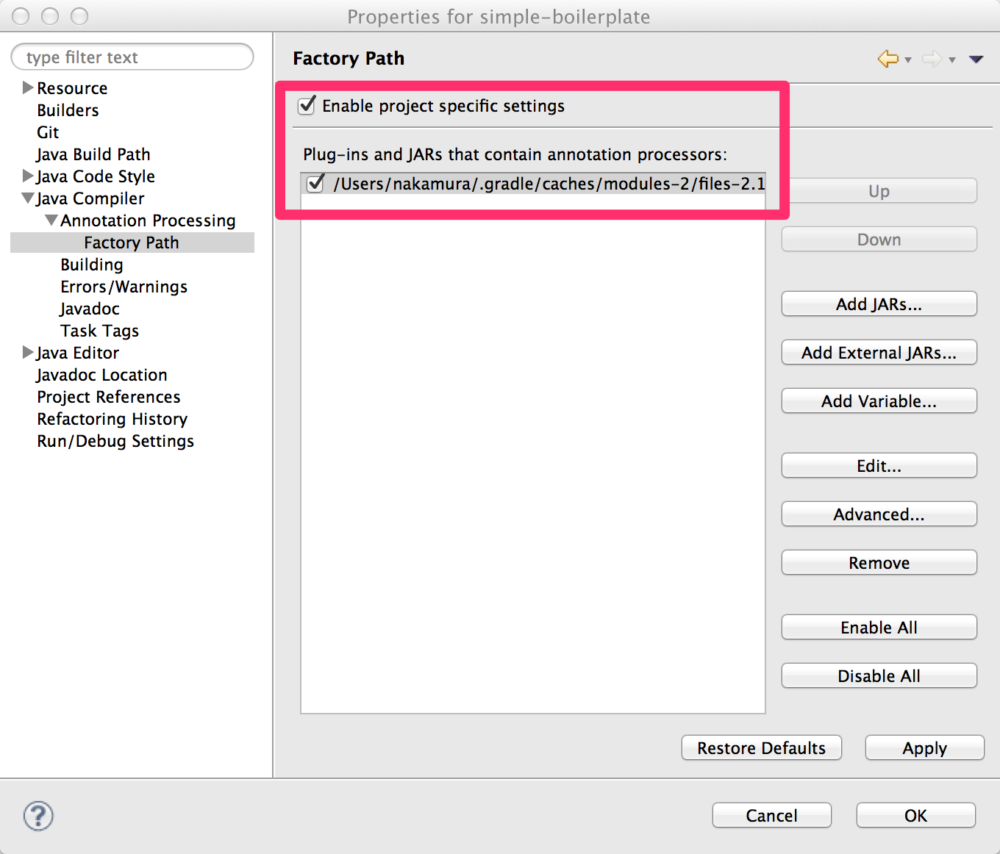

==================
ビルド
==================

.. contents:: 目次
   :depth: 3

Maven Central Repository
========================

Doma の jar ファイルは Maven Central Repository から入手できます。
GroupId と ArtifactId の名称は以下の通りです。

:GroupId: org.seasar.doma
:ArtifactId: doma

Eclipse を使ったビルド
======================

Eclipse でビルドを行う際のポイントは以下の通りです。

* プロジェクトの設定で注釈処理を有効にする
* Build Path に加えて Factory Path にも Doma の jar ファイルを設定する

.. note::

  手動で設定するよりも Gradle の eclipse タスクで自動設定することを推奨します。
  詳細については、
  `domaframework/simple-boilerplate <https://github.com/domaframework/simple-boilerplate>`_ 
  に含まれる build.gradle と eclipse.gradle を参照ください。

注釈処理の有効化
----------------

注釈処理を有効化するには、メニューから Project > Properties を選んで画面を開き
左のメユーから Java Compiler > Annotation Processing を選択します。

そして、下記に示すチェックボックスにチェックを入れます。

.. image:: images/annotation-processing.png
   :width: 80 %

|

Factory Path の設定
-------------------

注釈処理を有効化するには、メニューから Project > Properties を選んで画面を開き
左のメユーから Java Compiler > Annotation Processing > Factory Path を選択します。

そして、下記に示すチェックボックスにチェックを入れ、
ビルドパスで指定しているのと同じバージョンの Doma の jar を登録します。

|

Gradle を使ったビルド
=====================

Gradle でビルドを行う際のポイントは以下のとおりです。

* JavaクラスとSQLファイルの出力先ディレクトリを同じにする
* コンパイルより前にSQLファイルを出力先ディレクトリにコピーする
* 依存関係の設定でdomaへの依存を指定する

サンプルのbuild.gradleです。

.. code-block:: groovy

  apply plugin: 'java'

  // JavaクラスとSQLファイルの出力先ディレクトリを同じにする
  processResources.destinationDir = compileJava.destinationDir
  // コンパイルより前にSQLファイルを出力先ディレクトリにコピーするために依存関係を逆転する
  compileJava.dependsOn processResources

  repositories {
      mavenCentral()
      maven {url 'https://oss.sonatype.org/content/repositories/snapshots/'}
  }

  dependencies {
      compile "org.seasar.doma:doma:2.7.1-SNAPSHOT"
  }

.. note::

  リポジトリにおける https://oss.sonatype.org/content/repositories/snapshots/ の設定は
  Doma の SNAPSHOT を参照したい場合にのみ必要です。

  Doma の SNAPSHOT は `Travis-CI <https://travis-ci.org/domaframework/doma>`_
  でビルドが成功されるたびに作成されリポジトリに配置されます。

Gradle を使ったより詳細なビルドスクリプトの例として、
`domaframework/simple-boilerplate <https://github.com/domaframework/simple-boilerplate>`_ 
を参照にしてください。
