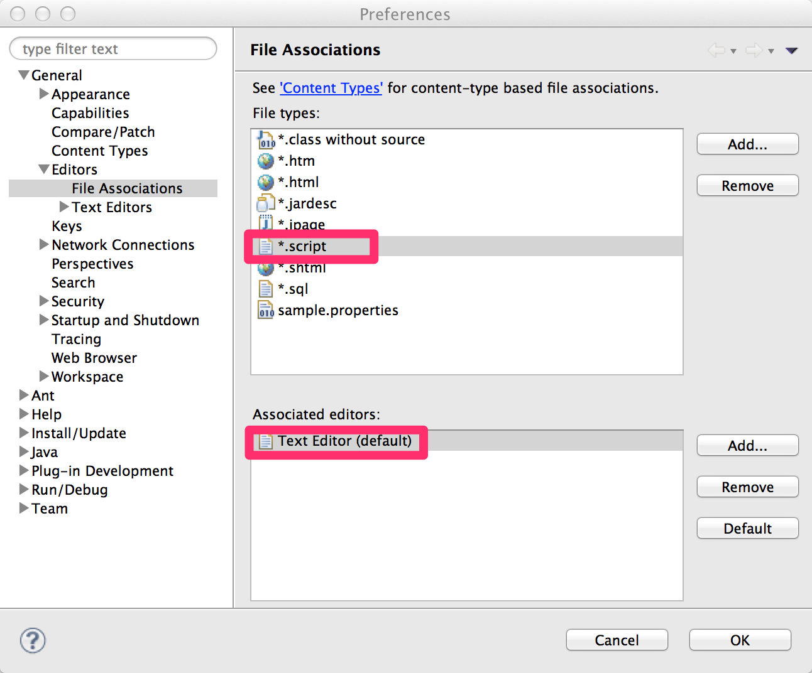
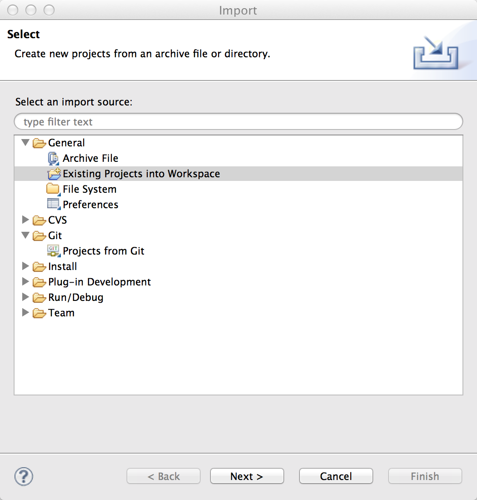

=======================
Getting Started
=======================

.. contents:: 目次
   :depth: 3

概要
====

開発環境のセットアップ方法と基本的なデータベースアクセスの実行方法を紹介します。

.. _IntelliJ Doma support plugin: https://github.com/siosio/DomaSupport

.. note::

  このドキュメントでは、IDE として Eclipse を用いますが、
  Eclipse の代わりに IntelliJ IDEA を利用して開発することも可能です。
  IntelliJ IDEA を利用する場合は、 `IntelliJ Doma support plugin`_ の併用をお奨めします。

JDK のインストール
==================

.. _JDK 8: http://www.oracle.com/technetwork/java/javase/downloads/jdk8-downloads-2133151.html

`JDK 8`_ をインストールしてください。

Eclipse のインストール
======================

.. _Eclipse Standard 4.4: http://www.eclipse.org/downloads/

`Eclipse Standard 4.4`_ をインストールしてください。

.. note::

  Eclipse IDE for Java EE Developers など他のパッケージでも動作しますが
  このドキュメントでは Eclipse Standard を対象とします。

Eclipse プラグイン Doma Tools のインストール
============================================

Doma Tools は Java ファイルと SQL ファイルの相互遷移を可能にするプラグインです。
Doma の利用に必須ではありませんが、このプラグインを使用すると生産性が高まります。

Eclipse メニューバーから Help > Install New Software... と進み、
'Work With' のテキストボックスに次のURLを入力してください。

::

  http://dl.bintray.com/domaframework/eclipse/

以下の図のようにインストール可能なプラグインの候補が表示されるので
Doma Tools の最新バージョンにチェックをつけてダイアログを進め
インスートルを完了してください。

.. image:: images/install-doma-tools.png

ファイルの関連づけ
------------------

Doma Tools は、 SQL ファイルの更新をフックして注釈処理を実行します。
そのためには、 SQL ファイルを Eclipse 内で開く必要があります。

メニューバーから Eclipse > 環境設定... もしくは Window > Preference と選択し、設定画面を開いてください。

以下の図が示すように ``.sql`` の拡張子をもつファイルを Text Editor に関連づけてください。

.. image:: images/sql-file-association.png
   :width: 80 %

同様に ``.script`` の拡張子をもつファイルを Text Editor に関連づけてください。

.. note::

   Eclipse IDE for Java EE Developers を利用する場合は、
   デフォルトでSQLファイルが専用のエディタに関連づけられているため
   この手順をスキップできます。

.. _Oracle SQL Developer: http://www.oracle.com/technetwork/developer-tools/sql-developer/overview/index.html
.. _pgAdmin: http://www.pgadmin.org/

.. note::

  SQL は RDBMS 固有のツール（`Oracle SQL Developer`_ や `pgAdmin`_）で作成し、
  完成したものを Eclipse のエディターにコピーするといった
  開発スタイルをお奨めします。

雛形プロジェクトのインポート
============================

GitHub から simple-boilerplate を clone してください。

.. code-block:: bash

  $ git clone git@github.com:domaframework/simple-boilerplate.git

clone されたディレクトリに移動します。

.. code-block:: bash

  $ cd simple-boilerplate

次のコマンドで Eclipse 用の設定ファイルを生成します。

.. code-block:: bash

  $ ./gradlew eclipse

.. note::

  Windows 環境では ``./gradlew eclipse`` とする代わりに ``gradlew eclipse`` としてください。

.. note::

  環境変数 ``JAVA_HOME`` に JDK 8 をインストールしたディレクトリを設定しておいてください。
  gradlew の実行に必要です。

Eclipse のメニューからFile > Import... を実行し
'Existing Projects into Workspace' を選んで simple-boilerplate をインポートします。

インポートが成功したことを確認するためにプロジェクトを選択して JUnit を実行してください。
テストが1件成功すれば正常にインポートできています。

雛形プロジェクトの構成
======================

プロジェクトのソースコードの構成は次のようになっています。

::

  ─ src
    ├── main
    │   ├── java
    │   │   └── boilerplate
    │   │       ├── AppConfig.java
    │   │       ├── dao
    │   │       │   ├── AppDao.java
    │   │       │   └── EmployeeDao.java
    │   │       └── entity
    │   │           └── Employee.java
    │   └── resources
    │       └── META-INF
    │           └── boilerplate
    │               └── dao
    │                   ├── AppDao
    │                   │   ├── create.script
    │                   │   └── drop.script
    │                   └── EmployeeDao
    │                       ├── selectAll.sql
    │                       └── selectById.sql
    └── test
        ├── java
        │   └── boilerplate
        │       ├── DbResource.java
        │       └── dao
        │           └── EmployeeDaoTest.java
        └── resources

主要なものについて説明します。

AppConfig.java
  Doma を実行するために必要な :doc:`config` です。

AppDao.java
  このアプリケーションで利用するデータベースのスキーマを実行時に作成/破棄するユーティリティです。
  実環境では不要になります。
  スキーマの作成と破棄には ``META-INF/boilerplate/dao/AppDao/`` 以下のスクリプトファイルを使用します。

Employee.java
  データベースの `EMPLOYEE` テーブルに対応する :doc:`entity` です。

EmployeeDao.java
  ``Employee`` クラスの取得や更新などを行う :doc:`dao` です。
  ``META-INF/boilerplate/dao/EmployeeDao/`` 以下の SQLファイル を使用します。

EmployeeDaoTest.java
  ``EmployeeDao`` を使ったテストです。
  このファイルにテストケースを追加しながら Doma の学習ができます。
  テストメソッドごとにデータベーススキーマの作成と破棄を行っているため
  データの更新によって他のテストが影響を受けることはありません。

Java と SQL の相互遷移
======================

``EmployeeDao.java`` では次のように定義されています。

.. code-block:: java

  @Dao(config = AppConfig.class)
  public interface EmployeeDao {

      @Select
      List<Employee> selectAll();

      @Select
      Employee selectById(Integer id);

      @Insert
      int insert(Employee employee);

      @Update
      int update(Employee employee);

      @Delete
      int delete(Employee employee);

  }

Eclipse のエディタ上で ``selectById`` メソッドにカーソルを合わせ右クリックなどで
コンテキストメニューを表示させてください。
メニューの中から Doma > Jump to SQL を選択すると
``META-INF/boilerplate/dao/EmployeeDao/selectById.sql`` ファイルへ遷移できます。

次に、``META-INF/boilerplate/dao/EmployeeDao/selectById.sql`` ファイルの任意の場所に
カーソルを置き、コンテキストメニューを表示させてください。
メニューの中から Doma > Jump to Java を選択すると
``EmployeeDao.java`` ファイルへ戻ってこられます。

SQL ファイル
============

``META-INF/boilerplate/dao/EmployeeDao/selectById.sql`` ファイルを開いてください。
このファイルには次のように記述されています。

.. code-block:: sql

  select
      /*%expand*/*
  from
      employee
  where
      id = /* id */0

``/*%expand*/`` は Java メソッドでマッッピングされた
エンティティクラスの定義を参照してカラムリストを展開することを示しています。

``/* id */`` は Java メソッドのパラメータの値がこの SQL へバインドされることを
示しています。

後ろにある ``0`` はテスト用のデータです。
このテストデータを含めることで、 SQL をツールで実行して構文上の
誤りがないことを容易に確認できます。
テスト用のデータは Java プログラム実行時には使われません。

詳細については、 :doc:`sql`  を参照してください。

検索
====

:doc:`query/select` 処理を実行するには、 ``@Select`` が注釈された Dao メソッドを呼び出します。

検索処理の追加
--------------

ある年齢より小さい従業員を検索する処理を追加する手順を示します。

``EmployeeDao`` に次のコードを追加してください。

.. code-block:: java

   @Select
   List<Employee> selectByAge(Integer age);

このとき、注釈処理により次のエラーメッセージが Eclilpse 上に表示されます。

::

  [DOMA4019] ファイル[META-INF/boilerplate/dao/EmployeeDao/selectByAge.sql]が
  クラスパスから見つかりませんでした。

Eclipse のエディタ上で ``selectByAge`` メソッドにカーソルを合わせ右クリックなどで
コンテキストメニューを表示させ、メニューの中から Doma > Jump to SQL を選択してください。

SQL ファイルの新規作成を行うためのダイアログが次のように表示されます。

.. image:: images/new-sql-file.png
   :width: 80 %

'Finish' を押してファイルを作成してください。

ファイル作成後、ファイルを空のまま保管して ``EmployeeDao`` に戻ると
エラーメッセージの内容が変わります。

::

  [DOMA4020] SQLファイル[META-INF/boilerplate/dao/EmployeeDao/selectByAge.sql]が空です。

``selectByAge.sql`` ファイルに戻って次の SQL を記述してください。

.. code-block:: sql

  select
      /*%expand*/*
  from
      employee
  where
      age < /* age  */0

これでエラーが解消されます。

検索処理の実行
--------------

上記で作成した検索処理を実際に実行します。

``EmployeeDaoTest`` に次のコードを追加してください。

.. code-block:: java

  @Test
  public void testSelectByAge() {
      TransactionManager tm = AppConfig.singleton().getTransactionManager();
      tm.required(() -> {
          List<Employee> employees = dao.selectByAge(35);
          assertEquals(2, employees.size());
      });
  }

JUnit を実行し、このコードが動作することを確認してください。

このとき発行される検索のための SQL は次のものです。

.. code-block:: sql

  select
      age, id, name, version
  from
      employee
  where
      age < 35

挿入
====

:doc:`query/insert` 処理を実行するには、 ``@Insert`` が注釈された Dao メソッドを呼び出します。

挿入処理の実行
--------------

``EmployeeDao`` に次のコードが存在することを確認してください。

.. code-block:: java

  @Insert
  int insert(Employee employee);

このコードを利用して挿入処理を実行します。

``EmployeeDaoTest`` に次のコードを追加してください。

.. code-block:: java

  @Test
  public void testInsert() {
      TransactionManager tm = AppConfig.singleton().getTransactionManager();

      Employee employee = new Employee();

      // 最初のトランザクション
      // 挿入を実行している
      tm.required(() -> {
          employee.name = "HOGE";
          employee.age = 20;
          dao.insert(employee);
          assertNotNull(employee.id);
      });

      // 2番目のトランザクション
      // 挿入が成功していることを確認している
      tm.required(() -> {
          Employee employee2 = dao.selectById(employee.id);
          assertEquals("HOGE", employee2.name);
          assertEquals(Integer.valueOf(20), employee2.age);
          assertEquals(Integer.valueOf(1), employee2.version);
      });
  }

JUnit を実行し、このコードが動作することを確認してください。

このとき発行される挿入のための SQL は次のものです。

.. code-block:: sql

  insert into Employee (age, id, name, version) values (20, 100, 'HOGE', 1)

識別子とバージョン番号が自動で設定されています。

更新
====

:doc:`query/update` 処理を実行するには、 ``@Update`` が注釈された Dao メソッドを呼び出します。

更新処理の実行
--------------

``EmployeeDao`` に次のコードが存在することを確認してください。

.. code-block:: java

  @Update
  int update(Employee employee);

このコードを利用して更新処理を実行します。

``EmployeeDaoTest`` に次のコードを追加してください。

.. code-block:: java

  @Test
  public void testUpdate() {
      TransactionManager tm = AppConfig.singleton().getTransactionManager();

      // 最初のトランザクション
      // 検索して age フィールドを更新している
      tm.required(() -> {
          Employee employee = dao.selectById(1);
          assertEquals("ALLEN", employee.name);
          assertEquals(Integer.valueOf(30), employee.age);
          assertEquals(Integer.valueOf(0), employee.version);
          employee.age = 50;
          dao.update(employee);
          assertEquals(Integer.valueOf(1), employee.version);
      });

      // 2番目のトランザクション
      // 更新が成功していることを確認している
      tm.required(() -> {
          Employee employee = dao.selectById(1);
          assertEquals("ALLEN", employee.name);
          assertEquals(Integer.valueOf(50), employee.age);
          assertEquals(Integer.valueOf(1), employee.version);
      });
  }

JUnit を実行し、このコードが動作することを確認してください。

このとき発行される更新のための SQL は次のものです。

.. code-block:: sql

  update Employee set age = 50, name = 'ALLEN', version = 0 + 1 where id = 1 and version = 0

楽観的排他制御のためのバージョン番号が自動でインクリメントされています。

削除
====

:doc:`query/delete` 処理を実行するには、 ``@Delete`` が注釈された Dao メソッドを呼び出します。

削除処理の実行
--------------

``EmployeeDao`` に次のコードが存在することを確認してください。

.. code-block:: java

  @Delete
  int delete(Employee employee);

このコードを利用して削除処理を実行します。

``EmployeeDaoTest`` に次のコードを追加してください。

.. code-block:: java

  @Test
  public void testDelete() {
      TransactionManager tm = AppConfig.singleton().getTransactionManager();

      // 最初のトランザクション
      // 削除を実行している
      tm.required(() -> {
          Employee employee = dao.selectById(1);
          dao.delete(employee);
      });

      // 2番目のトランザクション
      // 削除が成功していることを確認している
      tm.required(() -> {
          Employee employee = dao.selectById(1);
          assertNull(employee);
      });
  }

JUnit を実行し、このコードが動作することを確認してください。

このとき発行される削除のための SQL は次のものです。

.. code-block:: sql

  delete from Employee where id = 1 and version = 0

識別子に加えバージョン番号も検索条件に指定されます。

